# eBPF Forensic Monitor  
This project builds a eBPF-based forensic monitoring system that captures kernel-level system activity, stores it in Elasticsearch, and applies advanced provenance analysis (HOLMES backward slicing + BEEP burst compression) to reconstruct an attack chain from noisy logs. A fully interactive Streamlit dashboard visualizes raw events, statistics, and an attack provenance graph, while a built-in AI engine (Ollama LLM) produces MITRE ATT&CK–aligned summaries explaining how the attack unfolded. The system includes an attack simulation script, a CLI for offline forensics, and a seamless workflow for monitoring, analyzing, and understanding live attacks end-to-end.

### **Forensic Monitor - Noise Reduction (BEEP + HOLMES) - AI Provenance Analysis**

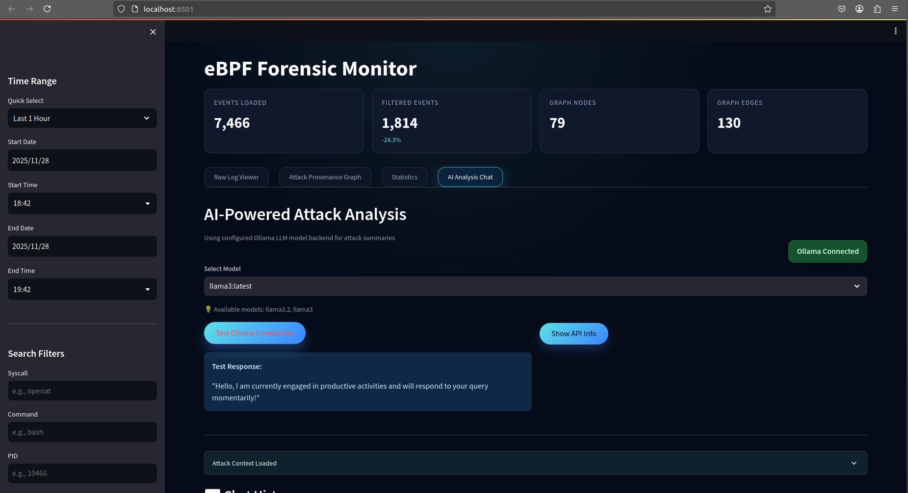
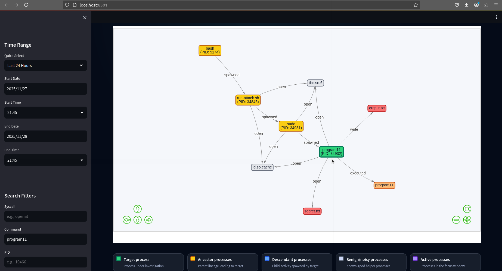

---

## Overview

**eBPF Forensic Monitor** is a security monitoring dashboard and attack-analysis system built using:

- **eBPF + BCC** for kernel-level syscall capture  
- **Elasticsearch** for scalable indexing  
- **Provenance graph reconstruction** with HOLMES backward slicing & BEEP noise compression  
- **Streamlit interactive dashboard**  
- **AI-driven explanations** via **Ollama local LLMs**  
- **CLI forensic interface**
  
---

## Requirements
- Ubuntu 20.04
- Linux kernel >= 5.4 with eBPF support
- sudo privileges (required for eBPF)
- BCC (BPF Compiler Collection)
  - Kernel headers matching your running kernel
  - Python BCC bindings (python3-bpfcc)
  - `sudo apt install bpfcc-tools python3-bpfcc linux-headers-$(uname -r)`
- Elasticserach 7.17.x
  - Running locally via Docker or System Install
  - Accessible at the host and port defined in `conf/config.json`
  - In config.json set `"es_host": "http://127.0.0.1:9200",`
- Docker
  - Install, enable, and start docker
  - `docker pull docker.elastic.co/elasticsearch/elasticsearch:7.17.0`
  - `docker run -p 9200:9200 -e discovery.type=single-node elasticsearch:7.17.0`
  
---

## Features

### **Low-level syscall capture with eBPF**
Monitors sensitive activity (`openat`, `connect`, `execve`, `write`, etc.)

### **Elasticsearch-powered event indexing**
Query, filter, paginate through thousands of events.

### **Advanced provenance graph builder**
Reconstructs the attack chain using:
- **HOLMES** suspicious path correlation  
- **BEEP** event burst compression  
- File/process noise elimination  

### **AI-powered attack analysis (Ollama)**
Generates:  
- Execution chain summary  
- IOA/IOC extraction  
- Root cause explanation 

### **Streamlit GUI Dashboard**
Visualizes:
- Raw logs  
- Provenance graphs  
- System statistics  
- AI reasoning  

### **Terminal CLI Tool**
For offline or remote forensic analysis

---

## System Showcase

### Dashboard Home  
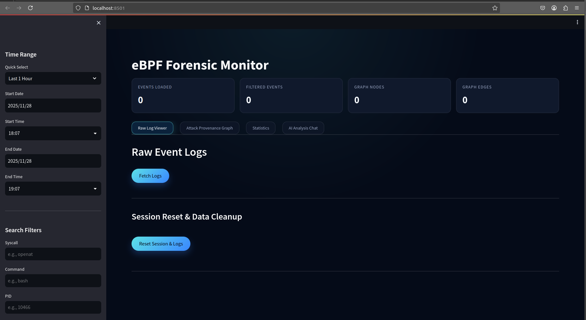

Displays:
- Total events  
- Filtered events  
- Graph nodes/edges  
- Quick navigation tabs  

---

### Raw eBPF Event Logs  
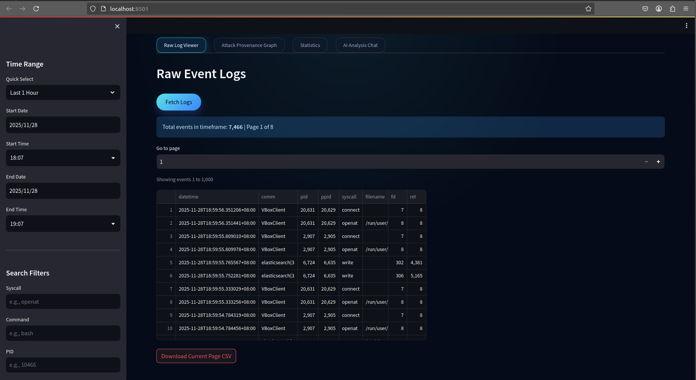

Includes:
- Syscall, PID, filename filters  
- Pagination (1000+ logs per page)  
- CSV export capability  
- Live Elasticsearch query backend  

---

### System Statistics  
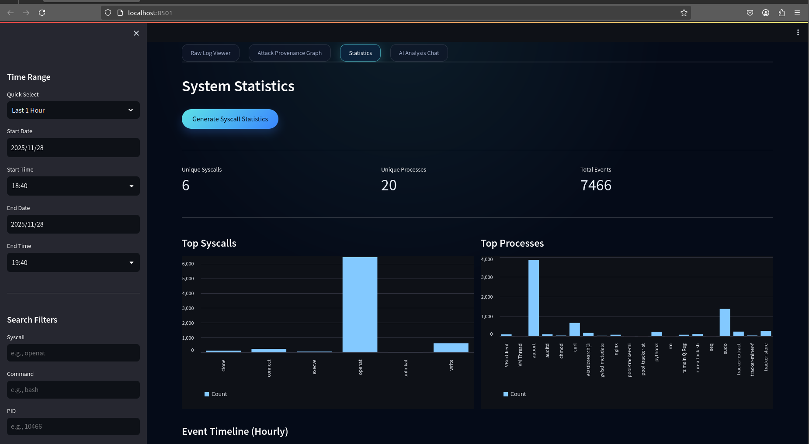

Panels include:
- Top syscalls  
- Top processes  
- Hourly event timeline  
- Unique syscall/process counters  

---

### Attack Provenance Graph  


Graph includes:
- Target process  
- Ancestors / descendants  
- Sensitive files  
- Staging files  
- Network endpoints  
- BEEP-compressed burst nodes  

---

### AI Analysis (Ollama Integration)

### Context Loading  
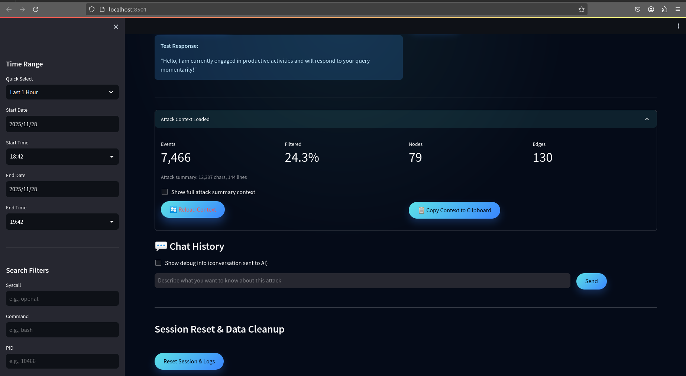

### AI Summarization and User Quereies 
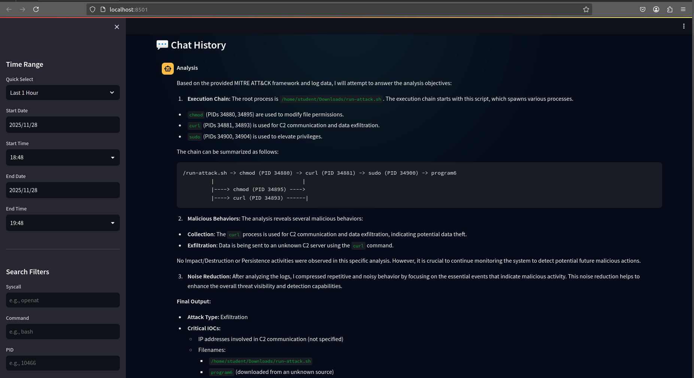

Produces:
- Execution chain  
- MITRE techniques  
- Behavioral summary  
- Data exfiltration analysis  

---

## Attack Simulation and eBPF Monitoring

### Running the provided attack script  
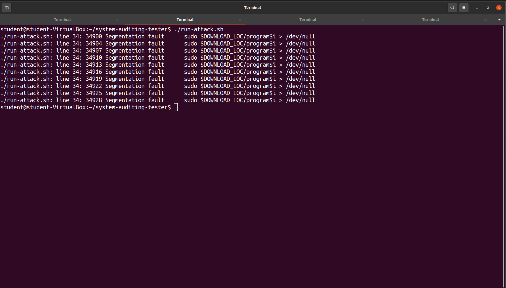

The script:
1. Starts fake attacker nginx server  
2. Victim downloads 11 binaries  
3. Executes them with sudo  
4. Malicious binary exfiltrates secret data  
5. Cleans up traces  

---

### Start eBPF Monitoring  
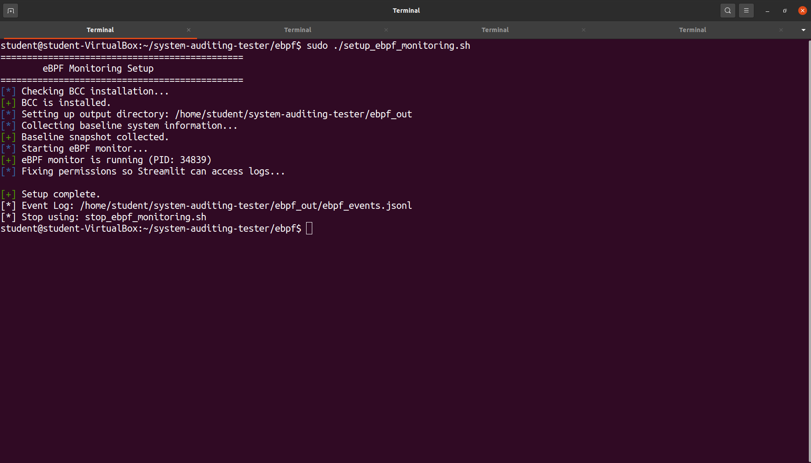

Captures:
- Baseline process tree  
- Open file descriptors  
- Socket table  
- Process metadata  

---

### Stop Monitoring  
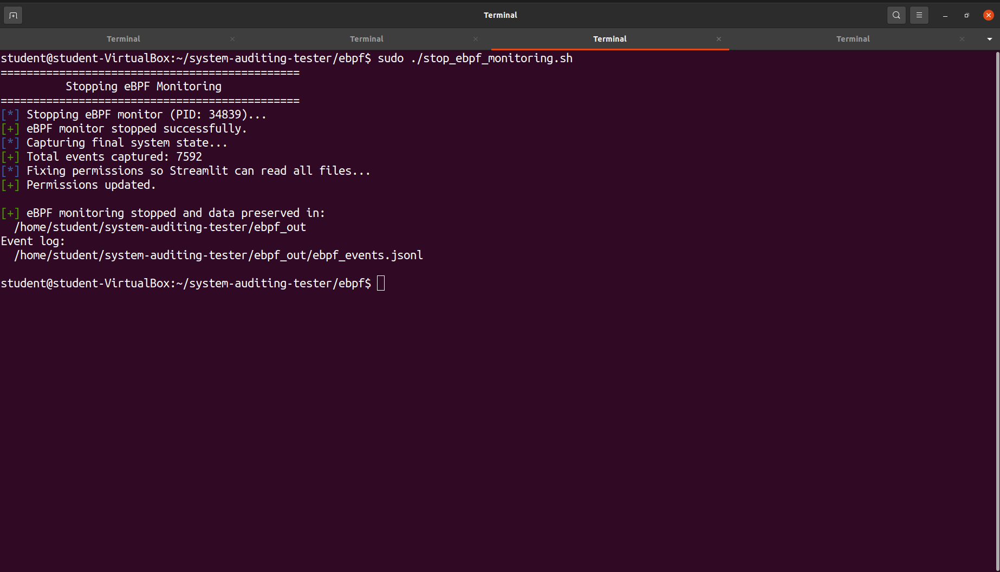

Outputs:
- Final process state  
- Final network state  
- Total events captured  
- JSONL logs in `ebpf_out/`

---

## Running the eBPF Forensic Monitor Dashboard

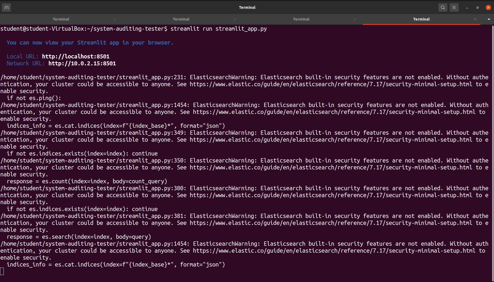

Start:
```bash
streamlit run streamlit_app.py
```

By default Streamlit will open on `http://localhost:8501/`.

---

## Configuration (`conf/config.json`)

Key fields in `conf/config.json`:

- `events_dir`: Directory where `ebpf_monitor.py` writes `ebpf_events.jsonl`.
- `output_dir`: Directory where analyzer outputs DOT graphs and attack summaries.
- `es_host`: Elasticsearch URL (e.g., `http://127.0.0.1:9200`).
- `es_index`: Base index name for events (e.g., `ebpf-events`).
- `es_user` / `es_password`: Elasticsearch credentials.
- `batch_size`: Number of events per bulk insert from the monitor.

Optional (used by `analyzer.py` if present):

- `max_events`: Integer cap on events loaded from Elasticsearch for large analyses.

Make sure `events_dir` and `output_dir` exist or are creatable by the user running the tools.

---

## End-to-End Workflow

1. **Start Elasticsearch**
   ```bash
   docker run -p 9200:9200 -e discovery.type=single-node elasticsearch:7.17.0
   ```

2. **Start the eBPF monitor (requires sudo)**
   ```bash
   cd /path/to/ebpf-system-provenance
   sudo python3 ebpf/ebpf_monitor.py --config conf/config.json
   ```

   This will:
   - Attach eBPF tracepoints for `execve`, `openat`, `write`, `unlinkat`, and `connect`.
   - Continuously write JSONL logs to `events_dir`.
   - Stream events into Elasticsearch (if reachable).

3. **(Optional) Run the provided attack simulation**
   In another terminal:
   ```bash
   cd /path/to/ebpf-system-provenance
   bash run-attack.sh
   ```

4. **Explore in the Streamlit dashboard**
   ```bash
   streamlit run streamlit_app.py
   ```

5. **Use the terminal CLI**
   ```bash
   python3 cli_app.py
   ```

   The CLI lets you:
   - Browse raw events with filters and pagination.
   - Build provenance graphs and write DOT/text summaries.
   - View syscall/process statistics.
   - Run AI-powered attack analysis chat (Ollama).
   - Clean up old logs locally and in Elasticsearch.

---

## Ollama / AI Analysis Setup

The dashboard and CLI can query a local Ollama instance to generate MITRE ATT&CK–style summaries and answer questions.

- Install and run Ollama: https://ollama.ai
- Start the server:
  ```bash
  ollama serve
  ```
- Pull a model (for example):
  ```bash
  ollama pull llama3.2
  ```

By default:
- `streamlit_app.py` uses `OLLAMA_HOST` environment variable or falls back to `http://127.0.0.1:11434`.
- `cli_app.py` uses `OLLAMA_HOST` or defaults to `http://192.168.56.1:11434`.

You can override the host for both by exporting:
```bash
export OLLAMA_HOST="http://127.0.0.1:11434"
```

---

## Repository Layout

- `ebpf/ebpf_monitor.py` – eBPF syscall monitor that logs to JSONL and Elasticsearch.
- `analyzer.py` – Provenance graph builder with HOLMES/BEEP noise reduction and DOT output.
- `streamlit_app.py` – Streamlit dashboard for interactive exploration and AI analysis.
- `cli_app.py` – Terminal-based interface mirroring the dashboard features.
- `conf/config.json` – Runtime configuration for monitor, analyzer, and frontends.
- `assets/` – Screenshots and demo assets used in this README.
- `run-attack.sh` – Example attack script to generate interesting telemetry.

With these components running together, you get a full pipeline from kernel-level telemetry to interactive provenance graphs and AI-assisted explanations of complex attacks.

---

## Project Variants and Credits

This repository contains the Streamlit- and CLI-based interface on top of the shared eBPF monitoring and provenance analysis core.

A companion version of this project, featuring a different user interface and additional refinements to the shared core, is being actively developed by my teammate [Amish](https://github.com/Vulcanite) in the public `system-provenance` repository. Feel free to explore and contribute.
